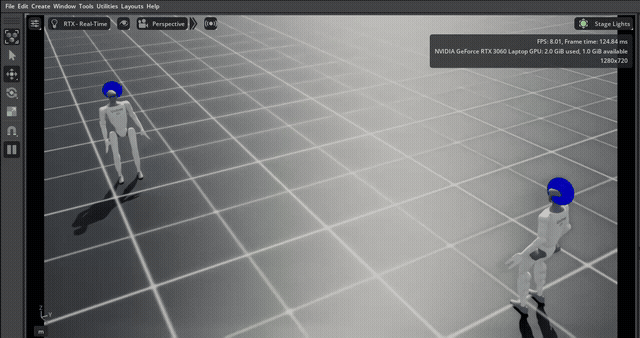
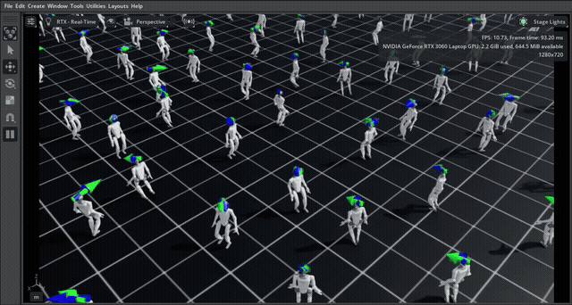
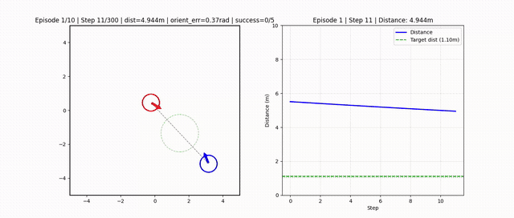
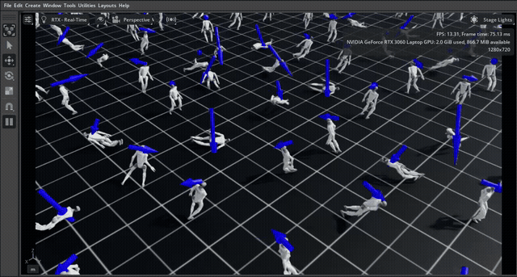
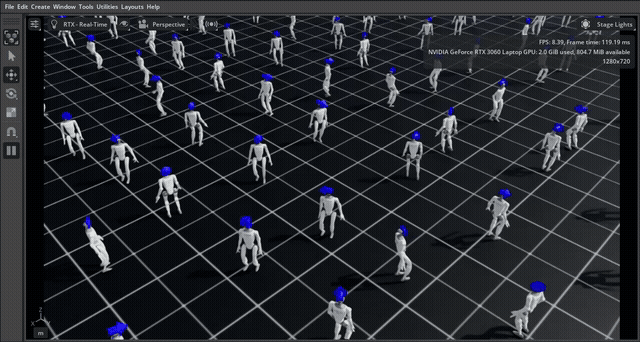
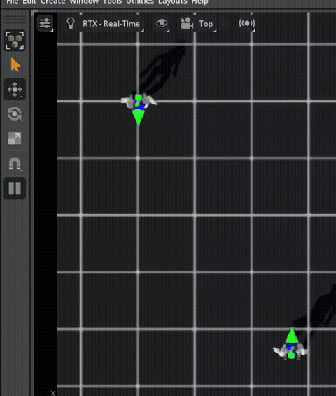

# H-MARL: Hierarchical Multi-Agent Reinforcement Learning for Humanoid Robot Interaction


> **A hierarchical multi-agent reinforcement learning framework enabling two Unitree G1 humanoid robots to autonomously locate, approach, and stop at a fixed distance from one another — combining a high-level PPO navigation policy with decentralized low-level PPO locomotion policies in NVIDIA Isaac Lab.**

---



---

## Overview

Training humanoid robots to operate collaboratively is a non-trivial challenge due to high-dimensional dynamics and contact discontinuities. This project presents **H-MARL**, a two-tiered hierarchical control architecture that decouples task-level navigation from motor-level locomotion, enabling coordinated interaction between two full-body Unitree G1 humanoids trained entirely in simulation.

The specific task: two humanoid robots start at random positions on a flat plane, identify each other, walk toward one another via stable bipedal locomotion, and stop at a specified distance.

---

## Simulation

<table>
  <tr>
    <td align="center"><br/><em>Low-Level walk policy — stable omnidirectional gait after full curriculum</em></td>
    <td align="center"><br/><em>High-Level meetup — agents converge from random start positions</em></td>
  </tr>
</table>

<table>
  <tr>
    <td align="center"><br/><em>Low-Level Phase 1 — standing stabilization before walking curriculum</em></td>
    <td align="center"><br/><em>Low-Level Phase 2 — stable standing, pre-walking</em></td>
  </tr>
</table>

<table>
  <tr>
    <td align="center"><br/><em>Full system — top-down view of meetup task</em></td>
    <td align="center"><br/><em>Full system — side view of coordinated approach</em></td>
  </tr>
</table>

---

## Results

The system successfully demonstrated hierarchical control. Agents identified the target, oriented themselves, and converged via stable bipedal locomotion.

| Metric | Result |
|---|---|
| **Task outcome** | ✅ Successful convergence via bipedal locomotion |
| **High-Level training steps** | ~1,000,000 |
| **Distance error post-training** | Smooth reduction to target tolerance (0.05 m) |
| **Velocity commands tracked** | ±1.0 m/s linear, full heading control |
| **Orientation alignment** | cos similarity > 0.97 at meetup |
| **Stop condition** | lin speed < 0.05 m/s, ang speed < 0.05 rad/s |
| **Known limitation** | Slower re-orientation when agents start back-to-back due to base velocity command clipping |

---

## System Architecture

The control stack is divided into two levels:

**High-Level Policy (Navigation)**
- Observes global state: positions and headings of both agents
- Outputs target waypoints (x, y, heading) for each robot
- Network: MLP [64, 64], ReLU activation
- Handles the lower-dimensional 2D kinematic planning problem

**Low-Level Policy (Locomotion)**
- Each robot runs an independent PPO instance
- Inputs: joint states (q, q̇), base pose, base velocities, and the high-level velocity commands (v_cmd, ω_cmd)
- Outputs: joint position deltas across 29 active DOF
- Network: MLP [256, 256], ELU activation — larger capacity required for high-dimensional humanoid dynamics

```
┌─────────────────────────────────────────────────────┐
│                  High-Level PPO                     │
│         (global state → waypoint commands)          │
└────────────────┬───────────────┬────────────────────┘
                 │               │
       ┌─────────▼──────┐ ┌──────▼─────────┐
       │ Low-Level PPO  │ │ Low-Level PPO  │
       │   (Robot 1)    │ │   (Robot 2)    │
       └─────────┬──────┘ └──────┬─────────┘
                 │               │
       ┌─────────▼───────────────▼─────────┐
       │         Isaac Lab Environment      │
       └───────────────────────────────────┘
```

---

## Training Curriculum

### Low-Level (Locomotion) — 30M total steps, N=256 parallel envs

Training progresses through 7 phases:

| Phase | Description | Key Reward Terms |
|---|---|---|
| 1 — Standing | Stabilize base height and orientation | alive bonus (+4.0), base height penalty (-3.0) |
| 2 — Straight Walking | Linear forward movement | track_lin_vel_xy_exp (4.0) |
| 3 — Lateral Walking | Sidestepping | track_lin_vel_xy_exp, feet_air_time |
| 4 — Holonomic Walking | Maintain heading while moving | track_ang_vel_z_exp (5.0) |
| 5 — Arc Walking | Turning in gentle arcs | combined linear + angular tracking |
| 6 — Spot Turning | Rotating in place | track_ang_vel_z_exp, symmetry terms |
| 7 — Omnidirectional | Full direction + heading control | all terms active |

### High-Level (Navigation) — 1M total steps, single env

| Phase | Steps | Objective |
|---|---|---|
| Phase 0 — Approach | 150k | Minimize Euclidean distance to target |
| Phase 1 — Orientation | 200k | Enable heading rewards; agents face each other |
| Phase 2 — Meetup | 400k | Full stop constraints; sparse success reward (+300) |

---

## Reward Structure

**Low-Level (selected terms)**

| Term | Weight | Purpose |
|---|---|---|
| track_lin_vel_xy_exp | 4.0 | Linear velocity tracking |
| track_ang_vel_z_exp | 5.0 | Yaw rate tracking |
| termination_penalty | -50.0 | Penalize falls |
| feet_air_time | 1.0 | Encourage stepping over shuffling |
| flat_orientation_l2 | -2.5 | Keep torso upright |
| air_time_symmetry | -4.0 | Enforce symmetric gait |
| undesired_contacts | -1.0 | Penalize non-foot contacts |

**High-Level**

| Term | Weight | Purpose |
|---|---|---|
| approach_weight | 45.0 | Dense distance reduction reward |
| orientation_reward | 5.0 | Agents face each other |
| success_reward | 300.0 | Sparse terminal reward at meetup |
| step_penalty | -0.1 | Encourage time-optimal behavior |

---

## Environment Details

- **Simulator**: NVIDIA Isaac Lab 5.1.0
- **Robot**: Unitree G1 — full humanoid, ~37 observable joints, 29 active DOF
- **Active DOF breakdown**: hips (3-DOF), knees (1-DOF), ankles (2-DOF), shoulders (3-DOF), elbows + torso
- **Training envs**: N=256 parallel (low-level), N=1 (high-level navigation)
- **Low-Level obs**: joint states, base pose, base velocities, velocity commands
- **High-Level obs**: (x, y, heading) for each agent
- **Action space**: joint position deltas (low-level), target waypoints (high-level)

---

## Installation

### Prerequisites
- Ubuntu 20.04 / 22.04
- CUDA 11.8+
- Isaac Lab 5.1.0 ([installation guide](https://isaac-sim.github.io/IsaacLab/))
- Python 3.8+

### Setup

Requires a working Isaac Lab 5.1.0 installation. This repo is **not standalone** — files must be copied into your existing Isaac Lab filesystem.

```bash
git clone https://github.com/SunnyDeshpande/H-MARL_Humanoid_Interaction.git
cd H-MARL_Humanoid_Interaction

# Copy environment configs into Isaac Lab's G1 locomotion task directory
cp code/envs/Flat_Meetup/* <ISAACLAB_ROOT>/source/isaaclab_tasks/isaaclab_tasks/manager_based/locomotion/velocity/config/g1/

# Copy training and demo scripts into Isaac Lab's RL scripts directory
cp code/scripts/*.py <ISAACLAB_ROOT>/scripts/reinforcement_learning/custom/
```

> **Note**: Replace `<ISAACLAB_ROOT>` with your local Isaac Lab installation path (e.g., `~/IsaacLab`).

### Training

```bash
cd <ISAACLAB_ROOT>

# Set path to cloned repo (for loading weights)
export HMARL_REPO=/path/to/H-MARL_Humanoid_Interaction

# Low-level locomotion training (resume from checkpoint, or omit --load_checkpoint to start fresh)
./isaaclab.sh -p scripts/reinforcement_learning/custom/train_ppo_g1.py \
  --task Isaac-Velocity-Flat-OneG1-v0 \
  --device cuda:0 \
  --phase walk \
  --num_envs 256 \
  --load_checkpoint $HMARL_REPO/weights/low-level/checkpoint/low-level/ppo_walk_final.zip \
  --vecnorm_path $HMARL_REPO/weights/low-level/vecnorm/vecnormalize_final.pkl \
  --total_timesteps 1000000

# High-level navigation training (uses frozen low-level policy)
python3 scripts/reinforcement_learning/custom/train_hl_robot_meetup.py \
  --phase 2 \
  --phase2_steps 400000
```

### Demo

```bash
cd <ISAACLAB_ROOT>

# Low-level locomotion demo
./isaaclab.sh -p scripts/reinforcement_learning/custom/play_ppo_g1.py \
  --task Isaac-Velocity-Flat-OneG1-v0 \
  --device cuda:0 \
  --phase walk \
  --num_envs 4 \
  --checkpoint $HMARL_REPO/weights/low-level/checkpoint/low-level/ppo_walk_final.zip \
  --max_steps 5000

# High-level navigation demo
python3 scripts/reinforcement_learning/custom/play_hl_robot_meetup.py \
  --model_path $HMARL_REPO/weights/high-level/ppo_two_robot_phase2_final.zip \
  --episodes 10 \
  --phase 2 \
  --max_steps 300

# Full system demo (both levels running together)
./isaaclab.sh -p scripts/reinforcement_learning/custom/play_two_g1_meetup.py \
  --task Isaac-Velocity-Flat-OneG1-v0 \
  --device cuda:0 \
  --g1_checkpoint $HMARL_REPO/weights/low-level/checkpoint/low-level/ppo_walk_final.zip \
  --g1_vecnorm $HMARL_REPO/weights/low-level/vecnorm/vecnormalize_final.pkl \
  --meetup_checkpoint $HMARL_REPO/weights/high-level/ppo_two_robot_phase2_final.zip \
  --max_steps 5000
```

---

## Project Structure

```
H-MARL_Humanoid_Interaction/
├── code/
│   ├── envs/
│   │   └── Flat_Meetup/                        # env configs → Isaac Lab G1 locomotion task dir
│   │       ├── __init__.py
│   │       ├── flat_env_cfg.py                  # flat terrain environment config
│   │       ├── one_G1_env_cfg.py                # single-robot environment config
│   │       ├── rough_env_cfg.py                 # rough terrain environment config
│   │       └── two_g1_task_cfg.py               # dual-robot meetup task config
│   └── scripts/                                 # training/demo scripts → Isaac Lab RL custom dir
│       ├── train_ppo_g1.py                      # low-level locomotion training
│       ├── train_hl_robot_meetup.py             # high-level navigation training
│       ├── play_ppo_g1.py                       # low-level demo
│       ├── play_hl_robot_meetup.py              # high-level demo
│       └── play_two_g1_meetup.py                # full system demo (HL + LL)
├── weights/
│   ├── high-level/
│   │   └── ppo_two_robot_phase2_final.zip       # trained navigation policy
│   └── low-level/
│       ├── checkpoint/low-level/
│       │   └── ppo_walk_final.zip               # trained locomotion policy
│       └── vecnorm/
│           └── vecnormalize_final.pkl           # observation normalization stats
├── media/                                       # GIFs and screenshots
└── README.md
```

---


## Acknowledgments

- **Isaac Lab**: [isaac-sim/IsaacLab](https://github.com/isaac-sim/IsaacLab)
- **Unitree G1**: [unitreerobotics/unitree_rl_gym](https://github.com/unitreerobotics/unitree_rl_gym)
- **PPO**: Schulman et al., 2017 — [arXiv:1707.06347](https://arxiv.org/abs/1707.06347)
- **Course**: AE598 Reinforcement Learning, UIUC Fall 2025

---

## Author

**Sunny Deshpande** — MEng Autonomy & Robotics, UIUC  
[sunnynd2@illinois.edu](mailto:sunnynd2@illinois.edu) · [sunnydeshpande.com](https://sunnydeshpande.com)

---

*Built with Isaac Lab, PyTorch, and a lot of reward shaping*
